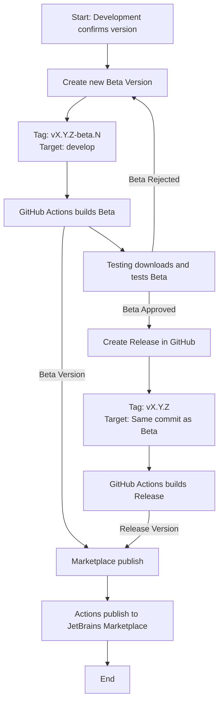

# IntelliJ Plugin Publication Procedura (Beta and Release)

This document describes the standard workflow for generating **BEta** (QA/Test) and **Release** (Production) version of the IntelliJ Plugin using GitHub as the repository and GitHub actions to generate build artifacts.

## Version types
| **Type**    | **Tag Format** | **Example**   | **Purpose**                          |
|-------------|----------------|---------------|--------------------------------------|
| **Beta**    | vX.Y.Z-beta.N  | v1.4.0-beta.1 | QA/Testing                           |
| **Release** | vX.Y.Z         | v1.4.0        | Final Production Release/Marketplace |

## Prerequisites
Before starting any publication:
- [X] The development team has confirmed the version number
- [X] Development team has validated the commit used for Beta creation
- [X] QA availability is confirmed for beta testing

## Procedure to Publish a Beta Version
A **Beta** is created so **QA** can validate the version before publishing the final release.

### Steps
1. Open the repository on GitHub
2. Naigate to **Releases**
3. Click **Draft a new release**
4. In **Tag version**, enter the BEta tag ussing this format:
    ```
    vX.Y.Z-beta.N
    ```
   Example:
   ```
    v1.4.0-beta.1
    ```
5. In **Target**, select:
    - main (or the branch specified by the development team)
6. Suggested release title:
    ````
    Version X.Y.Z-beta.N
    ```
7. In the description section, paste the **CHANGELOG** provided by the development team.
8. Enable the option **"This is a pre-release"**. 
9. Publish the release.

### Expected result:
- [X] GitHub Actions will start the BEta build process
- [X] A plugin artifact will be available for the QA team to download and test.
- [X] THe beta version will be published in the Beta channel in the Jetbrains Marketplace.

## Procedure to Publish a Release Version (Final Version)
THe final release **must be created from the exact same commit used for the apprved Beta**.

### Steps
1. Go to **Release** in the GitHub
2. Click **Draft a new release**
3. In **Tag Version**, enter the final tag (without the beta suffix).
    ```
    vX.Y.Z
    ```
   Example:
    ```
    v1.4.0
    ```
4. In the **Target**, select the **same commit** for the beta (selecting this from the commit dropdown or by choosing the beta tag).
5. Suggested title:
    ```
   Version X.Y.Z
    ```
6. Paste the same **CHANGELOG** used in the beta
7. **Do not** check the option **"This is a pre-release"**.
8. Publish the release.

